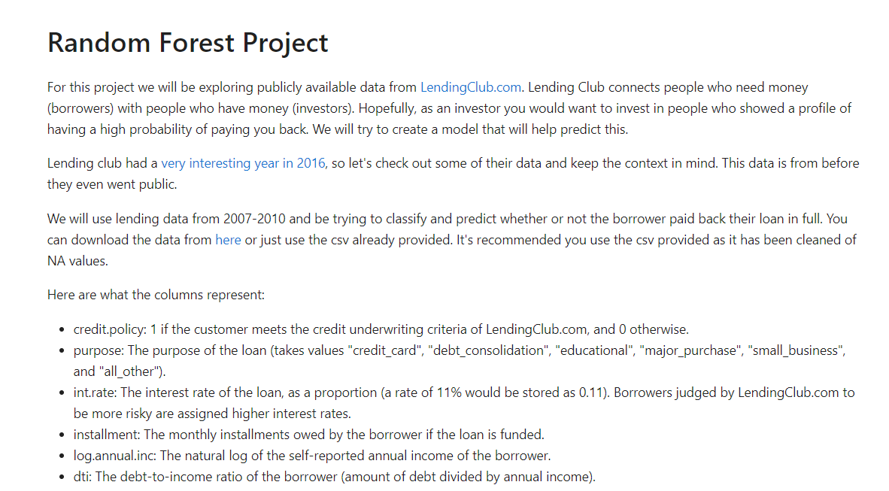

<br/>
<p align="center">

  <h3 align="center">LendPredict</h3>

  <p align="center">
    A machine learning project to predict loan repayment based on borrower features.
    <br/>
    <br/>
    <a href="https://github.com/itsskofficial/Machine-Learning">View Demo</a>
    .
    <a href="https://github.com/itsskofficial/Machine-Learning/issues">Report Bug</a>
    .
    <a href="https://github.com/itsskofficial/Machine-Learning/issues">Request Feature</a>
  </p>
</p>

 

## Table Of Contents

* [About the Project](#about-the-project)
* [Built With](#built-with)
* [Getting Started](#getting-started)
  * [Prerequisites](#prerequisites)
  * [Installation](#installation)
* [Usage](#usage)
* [Contributing](#contributing)
* [License](#license)
* [Authors](#authors)
* [Acknowledgements](#acknowledgements)

## About The Project



LendPredict is a machine learning project aimed at predicting loan repayment based on borrower features. Leveraging Python and popular libraries like Seaborn, Matplotlib, Numpy, Pandas, and Scikit Learn, the project utilizes a trained machine learning model to provide insights into whether a borrower is likely to pay back the loan.

## Built With

This section should list any major frameworks that you built your project using. Leave any add-ons/plugins for the acknowledgements section. Here are a few examples.

* [Python](https://python.org)
* [Seaborn](https://seaborn.pydata.org/)
* [Matplotlib](https://matplotlib.org/)
* [Numpy](https://numpy.org/)
* [Pandas](https://pandas.pydata.org/)
* [Scikit Learn](https://scikit-learn.org/)

## Getting Started

This is an example of how you may give instructions on setting up your project locally.
To get a local copy up and running follow these simple example steps.

### Prerequisites

* **pip:**
  
  Ensure you have Python installed, as pip comes bundled with Python distributions.

  ```sh
  # To upgrade pip to the latest version, run:
  python -m pip install --upgrade pip


### Installation

1. **Clone the repo**

    ```sh
    git clone https://github.com/itsskofficial/Machine-Learning.git
    ```

2. **Enter into the directory**
    ```sh
    cd Projects/LendPredict
    ```

3. **Install pip packages**

    ```sh
    pip install -r requirements.txt
    ```

## Usage

LendPredict is a tool designed to predict loan repayment based on borrower features. The project employs machine learning to analyze the provided features and generate predictions, aiding in decision-making processes related to lending.

## Contributing

Contributions are what make the open source community such an amazing place to learn, inspire, and create. Any contributions you make are greatly appreciated.

If you have a suggestion that would make this better, please fork the repo and create a pull request. You can also simply open an issue with the tag "enhancement". Don't forget to give the repository a star! Thanks again!

### Creating A Pull Request

1. Fork the Project
2. Create your Feature Branch (`git checkout -b feature/AmazingFeature`)
3. Commit your Changes (`git commit -m 'Add some AmazingFeature'`)
4. Push to the Branch (`git push origin feature/AmazingFeature`)
5. Open a Pull Request

## License

Distributed under the MIT License. See [LICENSE](https://github.com/itsskofficial/Machine-Learning/blob/main/LICENSE.md) for more information.

## Acknowledgements

* [Jose Portilla](https://www.udemy.com/user/joseportilla/)
